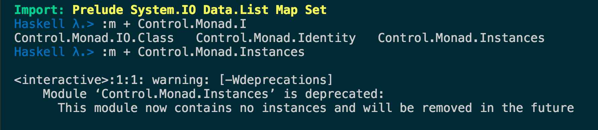

# Functor

- `Control.Monad.Instances` is deprecated


- `fmap :: Functor f => (a -> b) -> f a -> f b`
- `fmap` can be used to *lift* a function </br>
    - In this example, `count` has been lifted to a function which takes a `Functor` and return another `Functor`
    - It works like original `count` but on `Functor`.
```haskell
count :: String -> Int
count = length

fcount = fmap count
-- fcount ::Functor f => f String -> f Int
```
- As a result, we can actually rewrite the signature of `fmap` as </br>
`fmap :: (Functor f) => (a -> b) -> (f a -> f b)`
    - That is, it takes a `function` and return another `function` which works only on `Functor` types.
- `fmap` a function on `Nothing` will get `Nothing`
- `fmap` a function on `Left a` will get `Left a`. </br>ex:
```haskell
fmap (*2) (Left 3)
-- Left 3
fmap (*2) (Right 3)
-- Right 6
```
- `(->) a` is an instance of `Functor`
  - it means any function which takes one value and return a value is a `Functor`
    - That is, you can think of a function takes one value *hides* a new value in it (the value to be returned)
    - ex: `(*3)`, `show . (+3)`, `\x -> (\y -> x + y)`
  - `(->) :: * -> * -> *`
    - so `(-> a)` is a type will only one type variable
  - ex: `fmap (*3) (+3)`
  - equivalent to `(*3) . (+3)`
  - See `ghc/libraries/base/GHC/Base.hs`

## Fuctor Law

1. `fmap id = id`
    - `id :: a -> a`
    - however, the new `id` is lifted
    - `fmap id :: Functor f => f b -> f b`
2. `fmap (f . g) = fmap f . fmap g`
    - bad implementation of `Functor` type may fail to meet above laws.

```haskell
data CMaybe a = CNothing | CJust Int a deriving (Show)

instance Functor CMaybe where
    fmap f CNothing = CNothing
    fmap f (CJust count x) = CJust (count+1) (f x)

instance Eq a => Eq (CMaybe a) where
    (==) CNothing CNothing = True
    (==) (CJust c1 v1) (CJust c2 v2) = c1 == c2 && v1 == v2
    (==) _ _ = False

fmap id (CJust 0 "what") == id (CJust 0 "what")
-- False
``` 
- Of course, you can modify the implementation of `(==)` on `CMaybe` 
  to make the first law holds on `CMaybe` type. However, I think 
  it is conceptually inconsistent with what we expect.

## More Examples for `Functor`

```haskell
app :: Maybe ([Char] -> [Char])
app = fmap (++) (Just "Haha")
-- function in Haskell is curried by default
```
- In the example above:
  - `fmap :: (a -> b) -> f a -> f b`
  - `(++) :: [a] -> ([a] -> [a])`
  - `Just "Haha" :: Maybe [Char]`
  - `ghc` deduces:
    - `a == [Char]`
    - `b == [a] -> [a]`, which is in fact `[Char] -> [Char]`
  - so `app` has type `Maybe ([Char] -> [Char])`
- The reason why we can do this is that functions in **Haskell**
  are curried by default
- Intuition: `fmap` a function over a `Functor` is like wrapping a
  curried function into an execution context.

# Applicative

## Definition
A data type which is an `Applicative` if it has following two functions:
- `pure :: a -> f a`
- `(<*>) :: f (a -> b) -> f a -> f b`
  - `<*>` lifts a function wrapped in a `Functor`
  - `{-# MINIMAL pure, ((<*>) | liftA2) #-}`
  - `(<*>) = liftA2 id`
    - `id :: a -> a`
    - `liftA2 :: (a -> b -> c) -> (f a -> f b -> f c)`
    - `a = b -> c`, `f a = f (b -> c)`
    - `liftA2 id :: f (b -> c) -> f b -> f c`
  - `liftA2 f x = (<*>) (fmap f x)`
    - `liftA2 f x = f <$> x <*>` (since `<$> f x = fmap f x`)
    - `liftA2 :: Applicative f => (a -> b -> c) -> f a -> f b -> f c`
    - equivalent to `(a -> b -> c) -> (f a -> f b -> f c)`. We can say that `liftA2` takes a normal binary function and promotes it to a function that operates on two functors.
- Take `((->) r)` as example: 
```haskell
-- pure for ((->) r)
pure x = \_ -> x
f <*> g = \x -> f x (g x)
```

## Examples

- implementation of `<*>` for `[]`
```haskell
-- fs :: [ a -> b ]
fs <*> xs = [f x | f <- fs, x <- xs]
```
- implementation of `<*>` for `Maybe`
```haskell
Just f <*> m = fmap f m
```

- Quick note
  - Basically, what `<*>` does is that given a function in a context, `f` (`Functor`), and return a function which takes arguement in the **same** context and return a value wrapped in the **same** context.
  -  `<*>` is left-associative
  ```haskell
  a <*> b <*> c
  --- equivalent to
  ((a <*> b) <*> c )
  ```
- `<$>`: can be used with chaning `<*>`
  - `(<$>) :: Functor f => (a -> b) -> f a -> f b`
  - example:
  ```haskell
    (++) <$> Just "Hello" <*> Just "World"
    --- equivalent to following
    pure (++) <*> Just "Hello" <*> Just "World"
  ```
  - definition: `f <$> x = fmap f x`
    - IMHO, the difference between `<$>` and `fmap` is that `<$>` is defined as infix operator but `fmap` is defined as a function.
    - As a result, you can curry `fmap` but not `<$>`
    - ex: `fmap (+)` --> ok, of type `f a -> f (a -> a)`.
          `(+) <$>` --> not ok, not even a valid expression in `ghc`.
  - wrapping a function into a context.
  - `<$>` is defined in `Data.Functor`
  - `libraries/base/Data/Functor.hs`

- `ZipList` as a solution for zipping arbitrary arrays.
  - using `<*>` to extent this expression as long as you want.
```haskell
getZipList $ (,) <$> ZipList "What" <*> ZipList "Hell"
--- [('W','H'),('h','e'),('a','l'),('t','l')]
```

"Why we need `ZipList` if `[]` is already an `Applicative`?", you may ask.

Let's see some examples

```haskell
[(*3), (+2)] <*> [1, 2]
-- [3, 6, 3, 4]

getZipList $ ZipList [(*3), (+2)] <*> ZipList [1, 2]
-- [3, 4]
```

That is, if you `fmap` (`<*>`) over `[]`, you will get **all** possible results, whereas, `ZipList` will get results in a paired fashion, just like normal zip (that's why the name).

One useful property of `Applicative` is that we can use applicative style to chainning arbitrary number of functors. This free us from implementing functions zip 2, 3, 4, ...etc numbers of arguments
(like `zip3`, `zip4`, .... etc).

```haskell
zip3 [1,2] [3] [4,5]
--- [(1,3,4)]

getZipList $ (,,) <$> ZipList [1,2] <*> ZipList [3] <*> ZipList [4,5]
--- [(1,3,4)]
```

As you can see, together with `ZipList`, `<$>` and `<*>`, we can easily extend codes above to zip arbitrary number of lists.

- `liftA`: equivalent to `fmap`
- `liftA2 f a b`: equivalent to `f <$> a <*> b`

## Law of Applicative

1. `pure f <*> x = fmap f x`
2. `pure id <*> v = v`
3. `pure (.) <*> u <*> v <*> w = u <*> (u <*> v)`
4. `pure f <*> pure x = pure (f x)`
5. `u <*> pure y = pure ($ y) <*> u`


# `newtype` keyword

- When making new type with `newtype`, you can only have one value constructor having only one field.
- `ZipList` is defined by `newtype`
  - See `ghc/libraries/base/Control/Applicative.hs`

## Usage of `newtype`

- Wrapping types to make it an instance of the typeclass we want it to be.
- ex:
```haskell
-- Making tuple (a, b) an instance of Functor
-- Notice the order of type variables `a` and `b`
-- in the declaration of `Pair`.
newtype Pair b a = Pair { getPair :: (a,b) }
instance Functor (Pair c) where  
    fmap f (Pair (x,y)) = Pair (f x, y) 
```

## Laziness of `newtype`

- Compare following example

```haskell
--- using `data`
data CoolBool = CoolBool { getBool :: Bool }
--- using `newtype`
newtype CoolBool' = CoolBool' { getBool :: Bool }

helloMe :: CoolBool -> String
helloMe (CoolBool _ ) = "hello there!"

helloMe' :: CoolBool' -> String
helloMe' (CoolBool' _) = "hello there!"

helloMe undefined --- an exception in ghci
helloMe' undefined --- "hello there!"
```

- The reason for this is the laziness of `newtype`.
- type defined with `data` can have multiple value constructor. In order to know which value constructor should be used in the pattern matching, **Haskell** needs to evaluate the expression. Whereas, type defined by `newtype` is just a wrapped type which has only one value constructor. In this case, **Haskell** needs not to evaluate the expression in the match-all pattern.
- *Pattern matching on newtype values isn't like taking something out of a box (like it is with data), it's more about making a direct conversion from one type to another.* --- *\<Learn You a Haskell for Great Good\>*
- With this, we may think of `newtype` types are lazier than `data` types.

## `type`, `newtype` and `data`

- `type` create type alias.
  - type alias can be used interchangeably.
```haskell
type MyBool = Bool

hello :: MyBool -> String
hello b = if b then "Hello" else "hello"

b = True :: Bool
hello b -- "Hello"
```
- *If you just want your type signatures to look cleaner and be more descriptive, you probably want type synonyms. If you want to take an existing type and wrap it in a new type in order to make it an instance of a type class, chances are you're looking for a newtype. And if you want to make something completely new, odds are good that you're looking for the data keyword.*

# Monoid

- `Monoid` is semigroup with identity
  - [Wiki](https://en.wikipedia.org/wiki/Monoid)
  - [Semigroup](https://en.wikipedia.org/wiki/Semigroup)

## Monoid Law

- ``mempty `mappend` x = x``
- ``x `mappend` mempty = x``
- ``(x `mappend` y) `mappend` z = x `mappend` (y `mappend` z)``

## Quick Note on Monoid

- `mempty` is the identity element for `mappend`
- `mconcat` conceptually is the same as `foldr` with `mempty` as its starting value.

## Examples

- `Product` and `Sum`
  - They are also good example how to use `newtype` to wrap types making them instance of different typeclass seperately.
  - In this case, they make both `*` and `+` for `Num` instances of `Monoid`
- `Ordering`
  - `mempty = EQ`
  - ``LT `mappend` _ = LT``
  - ``EQ `mappend` y = y``
  - ``GT `mappend` _ = GT``
  - That is, `mappend` always return the first argument except when the first argument is `EQ`.
- `Monoid a => Maybe a`
 - `mempty = Nothing`
 - ``Nothing `mappend` m = m``
 - ``m `mappend` Nothing = m``
 - ``Just a `mappend` Just b = Just (a `mappend` b)``

# Foldable

- `import qualified Data.Foldable as F`
- It exports names clash with `Preclude`, better to import it qualified.
  - It expose `foldr`, `foldl`, `foldr1` and `foldl1`
  - The difference is that they works on all `Foldable` instances, whereas `Preclude` version work only on `[a]`

# Reference

- [Chapter 11](http://learnyouahaskell.com/functors-applicative-functors-and-monoids)
